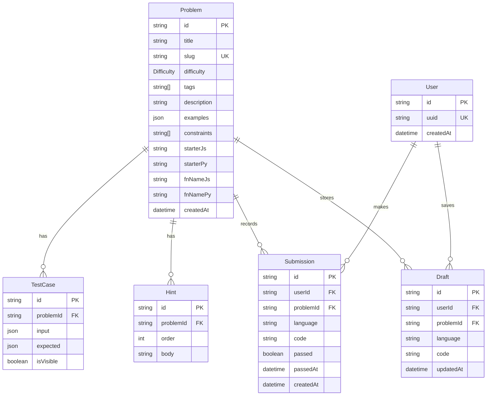

# vibe-code — Repository Architecture & Findings

## 1. Project Overview & Vision

**vibe-code** is a gamified, Discord-vibe LeetCode alternative designed for friendly, low-stress DSA problem solving. Unlike competitive coding platforms with high-pressure scoring and corporate aesthetics, vibe-code focuses on a chill learning atmosphere with informal slang feedback, anonymous sessions, and plans for multiplayer hangout rooms.

### Core Philosophy & Features

- **Zero Friction & Anonymous Identity**: No mandatory login or auth flows; users are identified by a persistent UUID generated client-side and stored in `localStorage` (`vibe_user_id`).
- **Interactive Problem Workspace**: Split-panel interface with problem descriptions, examples, constraints, collapsible hints, language switching (JavaScript & Python), code formatting, and Monaco Editor.
- **Run vs. Submit Dual-Execution**:
  - **Run**: Fast execution against public test cases (`isVisible: true`) without database writes.
  - **Submit**: Full test evaluation against all hidden and visible cases, writing submission records to PostgreSQL and returning encouraging hype or setback slangs (e.g., *"You cooked fr 🔥"*, *"Almost fam, check your edge cases 👀"*).
- **Dual-Layer Autosaving**: Instant local persistence via `localStorage` combined with periodic (30s interval), unmount, and keyboard shortcut (`Ctrl+S`/`Cmd+S`) flushes to database drafts.
- **Visual Distinction & Difficulty Scale**: Uses gaming-inspired difficulty tiers (`BEGINNER`, `AMATEUR`, `SEMI_PRO`, `PROFESSIONAL`, `LEGENDARY`).

---

## 2. Technology Stack

| Layer                       | Technology                                                                    | Details / Purpose                                                                                                 |
| --------------------------- | ----------------------------------------------------------------------------- | ----------------------------------------------------------------------------------------------------------------- |
| **Framework**         | [Next.js 16.2.6](https://nextjs.org/)                                          | App Router architecture, Server Components for DB querying, Client Components for Monaco editor & test runner UI. |
| **UI & React**        | [React 19.2.4](https://react.dev/)                                             | Utilizes modern React hooks, dynamic imports with SSR disabling for Monaco.                                       |
| **Database**          | [PostgreSQL 16](https://www.postgresql.org/)                                   | Containerized via Docker Compose, mapped to host port`5433`.                                                    |
| **ORM**               | [Prisma 7.8.0](https://www.prisma.io/)                                         | `@prisma/adapter-pg` engine driver, custom output directory at `src/generated/prisma`.                        |
| **Code Editor**       | [`@monaco-editor/react` 4.7.0](https://github.com/suren-atoyan/monaco-react) | Web-based VS Code editor loaded dynamically on client.                                                            |
| **Styling**           | [Tailwind CSS 4](https://tailwindcss.com/) + PostCSS                           | Configured via`@tailwindcss/postcss`.                                                                           |
| **Icons & Theming**   | `lucide-react` & `next-themes`                                            | System/light/dark theme toggling with theme synchronization in Monaco.                                            |
| **Sandbox Execution** | Piston (Docker) + Local Runner                                                | Piston container on port`2000`; local driver runner in `src/lib/piston.ts`.                                   |

---

## 3. Architecture & Code Execution Analysis

### Sandbox Environment & Piston Integration

#### Configured Infrastructure:

- `docker-compose.yml` configures two services:
  1. `postgres`: PostgreSQL 16 Alpine running on port `5433:5432`.
  2. `piston`: `ghcr.io/engineer-man/piston` running on port `2000:2000` with resource limits (`tmpfs`, `nofile: 65536`, `nproc: 512`).
- `scripts/setup-piston.sh` automates runtime installations in the Piston container for:
  - Python (`3.10.0`)
  - Node.js / JavaScript (`18.15.0`)

#### Current Execution Engine (`src/lib/piston.ts`):

Although named `piston.ts` and configured in docker, the current execution layer is implemented as a **direct host process execution** using Node.js `child_process.execFile`:

```
User Code + Test Cases 
        ↓
Driver Generator (buildJsDriver / buildPyDriver)
        ↓
Temp file in os.tmpdir() (vibe-exec-<timestamp>-<hash>.(js|py))
        ↓
execFileAsync (node / python3, 5000ms timeout)
        ↓
stdout (JSON test results) OR stderr (cleaned error messages)
        ↓
cleanup temp file in finally block
```

1. **Harness / Driver Code Generation**:
   - **JavaScript**: Generates an IIFE/wrapper that executes the target function with arguments unpacked (`fnName(...tc.input)`), evaluates deep equality via `JSON.stringify(output) === JSON.stringify(expected)`, and prints results JSON to `process.stdout`.
   - **Python**: Generates a script importing `json` and `sys`, executes `fnName(*tc["input"])`, checks `output == tc["expected"]`, and outputs JSON to `sys.stdout`.
2. **Path Resolution & Fallbacks**:
   - JavaScript checks `process.env.NVM_NODE_PATH` or `~/.nvm/versions/node/v20.20.2/bin/node` before falling back to system `node`.
   - Python executes `python3`.
3. **Error Handling & Stack Sanitization**:
   - `cleanErrorMessage()` parses stack traces from stderr, extracts syntax errors or runtime exceptions, and adjusts line numbers based on the injected driver code line offsets (1 for JS, 3 for Python) so users see errors relative to their own code.

---

## 4. Database Schema & Data Models

The Prisma schema (`prisma/schema.prisma`) models the core domain:



### Key Enums & Models:

- **`Difficulty`**: `BEGINNER`, `AMATEUR`, `SEMI_PRO`, `PROFESSIONAL`, `LEGENDARY`.
- **`TestCase`**: Separation between visible sample test cases (`isVisible: true`) and hidden test cases for full verification during submission.
- **`Draft`**: Composite unique index `@@unique([userId, problemId, language])` enabling persistent per-problem, per-language drafts across devices/sessions.

---

## 5. API Contracts & Endpoints

### 1. Run Code

- **Endpoint**: `POST /api/run`
- **Purpose**: Runs user code against public test cases without recording to DB.
- **Payload**:
  ```json
  {
    "problemId": "cuid...",
    "language": "javascript" | "python",
    "code": "function twoSum(...) { ... }"
  }
  ```
- **Response**:
  ```json
  {
    "results": [
      {
        "passed": true,
        "input": [[2, 7, 11, 15], 9],
        "expected": [0, 1],
        "output": [0, 1]
      }
    ],
    "passedCount": 1,
    "totalCount": 1
  }
  ```

### 2. Submit Solution

- **Endpoint**: `POST /api/submit`
- **Purpose**: Runs user code against all test cases, upserts anonymous user, and writes a `Submission` record.
- **Payload**:
  ```json
  {
    "problemId": "cuid...",
    "language": "javascript" | "python",
    "code": "...",
    "userUuid": "uuid-string"
  }
  ```
- **Response**:
  ```json
  {
    "passed": true,
    "results": [...],
    "message": "You cooked fr 🔥",
    "passedCount": 8,
    "totalCount": 8
  }
  ```

### 3. Solved Problems Query

- **Endpoint**: `GET /api/user/solved?uuid=<uuid>`
- **Response**:
  ```json
  { "solvedIds": ["problem-cuid-1", "problem-cuid-2"] }
  ```

### 4. Code Draft Autosave

- **Endpoint**: `GET /api/draft?uuid=...&problemId=...&language=...` → `{ "code": "..." | null }`
- **Endpoint**: `PUT /api/draft` → `{ "ok": true }`

---

## 6. Directory Structure & Key Files

```
vibe-code/
├── docker-compose.yml          # PostgreSQL (5433) + Piston (2000) containers
├── package.json                # Dependencies and scripts (Next 16, Prisma 7, React 19)
├── prisma.config.ts            # Prisma 7 configuration file
├── prisma/
│   ├── schema.prisma           # Database models (Problem, TestCase, Hint, User, Submission, Draft)
│   ├── seed.ts                 # 10 initial DSA problems with starter code & test cases
│   └── migrations/             # SQL schema migrations
├── scripts/
│   └── setup-piston.sh         # Script to install node/python packages into Piston container
├── src/
│   ├── app/
│   │   ├── layout.tsx          # Root layout with Geist fonts, header, and ThemeProvider
│   │   ├── page.tsx            # Home page: list of problems fetched via Prisma
│   │   ├── globals.css         # Tailwind 4 configuration
│   │   ├── problems/[slug]/
│   │   │   └── page.tsx        # Problem detail page: server-fetched data + split workspace
│   │   └── api/
│   │       ├── run/route.ts    # POST: non-persistent test runner
│   │       ├── submit/route.ts # POST: persistent evaluation & submission
│   │       ├── draft/route.ts  # GET/PUT: draft code synchronization
│   │       └── user/solved/
│   │           └── route.ts    # GET: returns user's completed problem IDs
│   ├── components/
│   │   ├── ProblemsList.tsx     # Client grid rendering ProblemCards with solved status
│   │   ├── ProblemCard.tsx      # Individual problem card with tags & badges
│   │   ├── ProblemWorkspace.tsx # Monaco editor, language selector, autosave & execution bar
│   │   ├── ResizableLayout.tsx  # Drag-to-resize split panels (horizontal / vertical)
│   │   ├── TestResults.tsx      # Test case pass/fail visualizer
│   │   ├── DifficultyBadge.tsx  # Gamified badge styling
│   │   ├── ThemeProvider.tsx    # Next-themes wrapper
│   │   └── ThemeToggle.tsx      # Dark/light theme switcher
│   ├── lib/
│   │   ├── prisma.ts            # Prisma client singleton with @prisma/adapter-pg
│   │   ├── piston.ts            # Local subprocess driver & code execution engine
│   │   ├── messages.ts          # Slang & hype response generator
│   │   └── utils.ts             # Tailwind class merge helper
│   ├── types/
│   │   └── index.ts             # TypeScript definitions & API response interfaces
│   └── generated/prisma/        # Generated Prisma client output
```

---

## 7. Key Findings & Recommendations

### 1. Code Execution Sandboxing & Security

- **Finding**: Currently, `src/lib/piston.ts` executes code directly on the host operating system using `child_process.execFile` rather than delegating execution to the Piston Docker container over HTTP (`http://localhost:2000/api/v2/execute`).
- **Security Implication**: Submitting malicious payloads (e.g. `process.exit()`, file system reads, infinite loops, fork bombs) runs directly on the server hosting the Next.js process.
- **Recommendation**: Complete the HTTP adapter in `piston.ts` to submit code payloads to the Piston container endpoint `POST /api/v2/execute`, isolating untrusted user code inside Piston's sandboxed environment.

### 2. Multi-Argument & Complex Type Serialization

- **Finding**: Test cases unpack arguments using spread syntax `...tc.input` (JS) and `*tc["input"]` (Python).
- **Recommendation**: When adding problems with custom data structures (e.g., Linked Lists, Binary Trees, Graph nodes), introduce custom driver serializers/deserializers into the driver code templates.

### 3. Metrics & Complexity Tracking

- **Finding**: The platform does not currently report runtime (ms) or memory footprint (KB/MB) back to the user upon submission.
- **Recommendation**: Capture execution wall-clock time and memory usage from Piston's response or `process.hrtime()` and render performance cards alongside test results.

### 4. Roadmap Realization (from `PLAN.md`)

- **Upcoming Features**:
  - Live collaborative rooms with WebSockets or WebRTC.
  - Whiteboard integrations ([tldraw](https://tldraw.dev/) / [Excalidraw](https://excalidraw.com/)).
  - Background audio player / chill low-fi ambient streams.
  - Friendly contest countdown timers.
